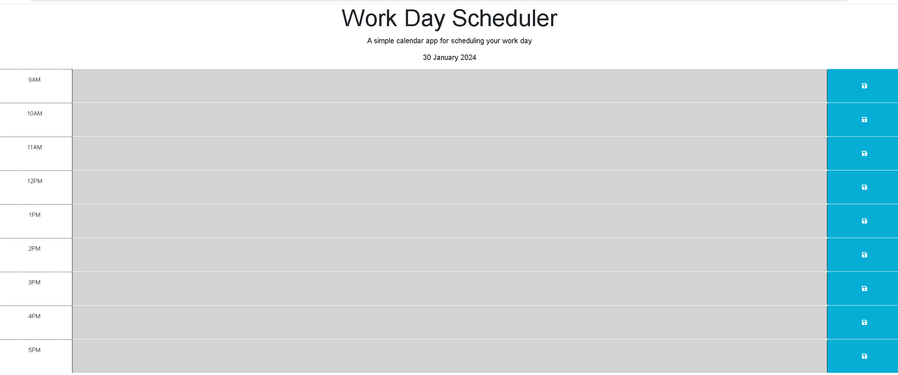

# workday_planner

## Description:

A simple work day planning app that utilizes Day.js and jQuery. It saves data to local storage and repopulates these fields upon page reload. It also detects the time of day and color codes the rows accordingly. 

### Deployed site can be found [here]()